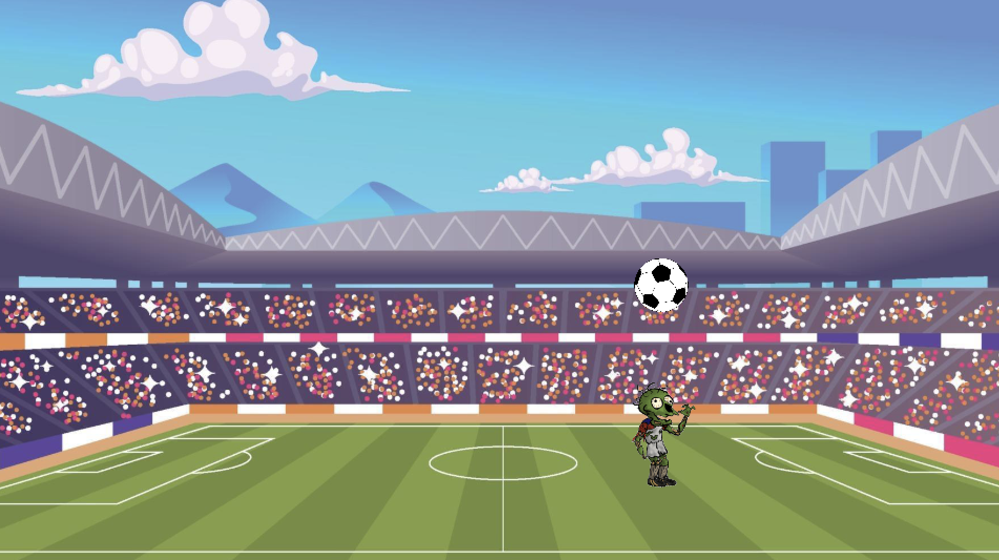

# unity-2d-soccer-game

Simple 2D game used for introduction to game development using Unity.

### Instructions

Google doc with instructions for building the game can be found here:

- [Build a simple 2D soccer game in Unity
](https://docs.google.com/document/d/1VKt-2gJg7psodEyEY1G-QcURRv4K3KrWR7gKJzaF29Q)

### Credits

The project is using following free assets:

- [Players](https://opengameart.org/content/zombie-soccer-assets)
- [Ball](https://en.m.wikipedia.org/wiki/File:Soccerball.svg)
- [Background](https://www.vecteezy.com/vector-art/3012060-crowded-football-stadium)
